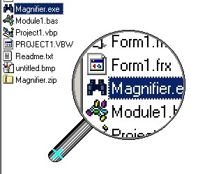



## Magnifier

### Description

This was created because I hated all those rectangular zoom windows. This allows you to magnify the screen in a magnifying glass. Much of this code was taken from PSC, if you want to vote for anyone vote for the people I borrowed from. So enjoy.
 
### More Info
 
read the readme.txt file

             |
---                |---
**Submitted On**   |2001-07-23 13:41:58
**By**             |[\|LOST\|](https://github.com/Planet-Source-Code/PSCIndex/blob/master/ByAuthor/lost.md)
**Level**          |Intermediate
**User Rating**    |4.2 (21 globes from 5 users)
**Compatibility**  |VB 6\.0
**Category**       |[Complete Applications](https://github.com/Planet-Source-Code/PSCIndex/blob/master/ByCategory/complete-applications__1-27.md)
**World**          |[Visual Basic](https://github.com/Planet-Source-Code/PSCIndex/blob/master/ByWorld/visual-basic.md)
**Archive File**   |[Magnifier233657232001\.zip](https://github.com/Planet-Source-Code/lost-magnifier__1-25394/archive/master.zip)

